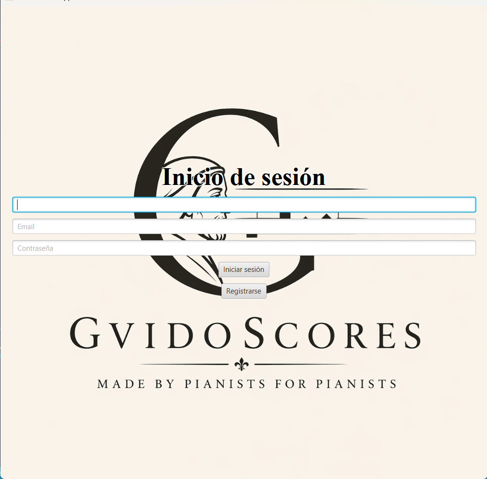
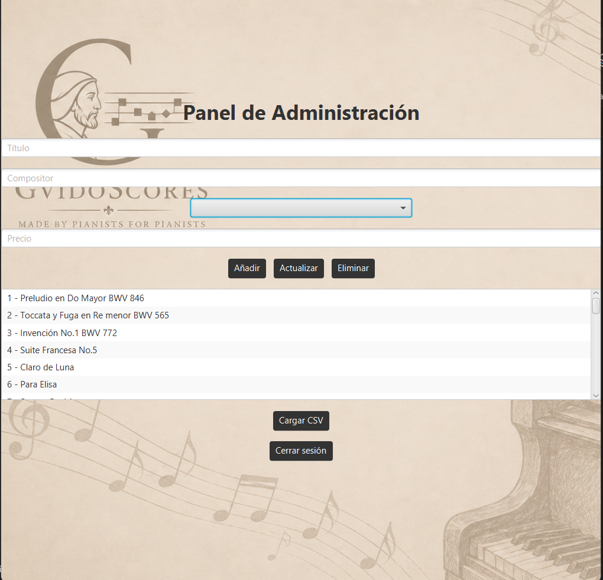
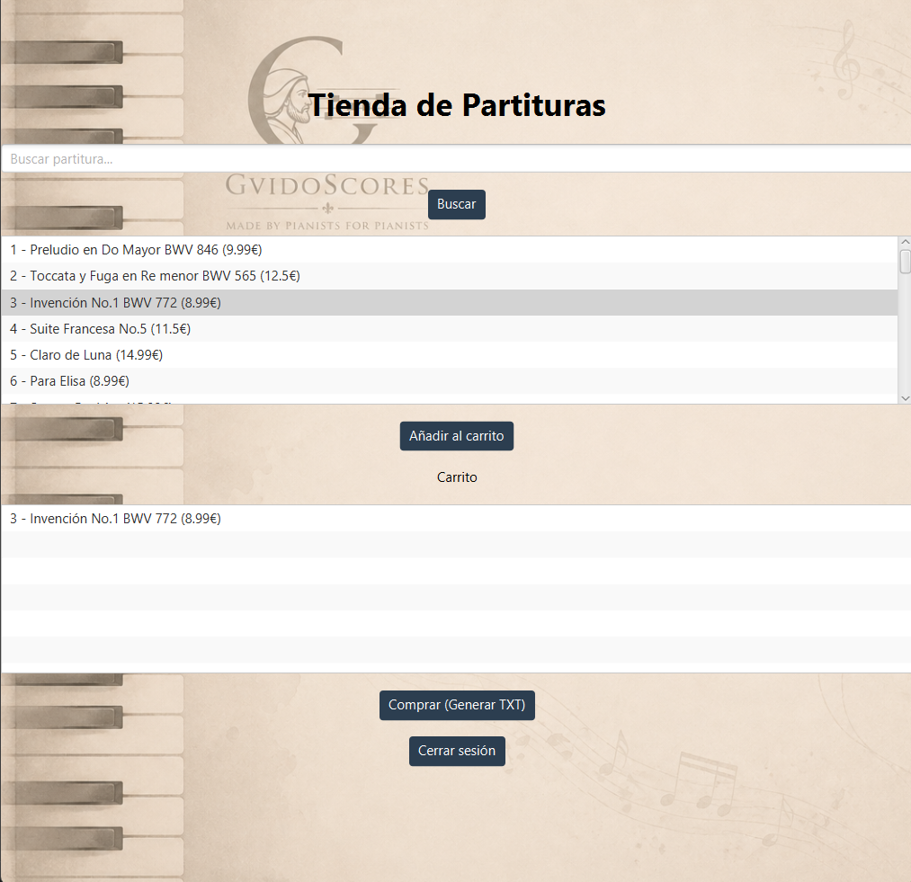
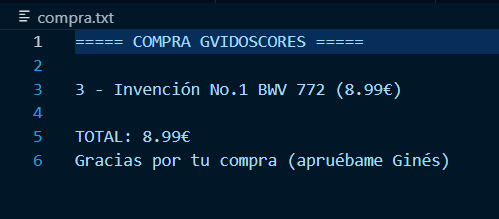
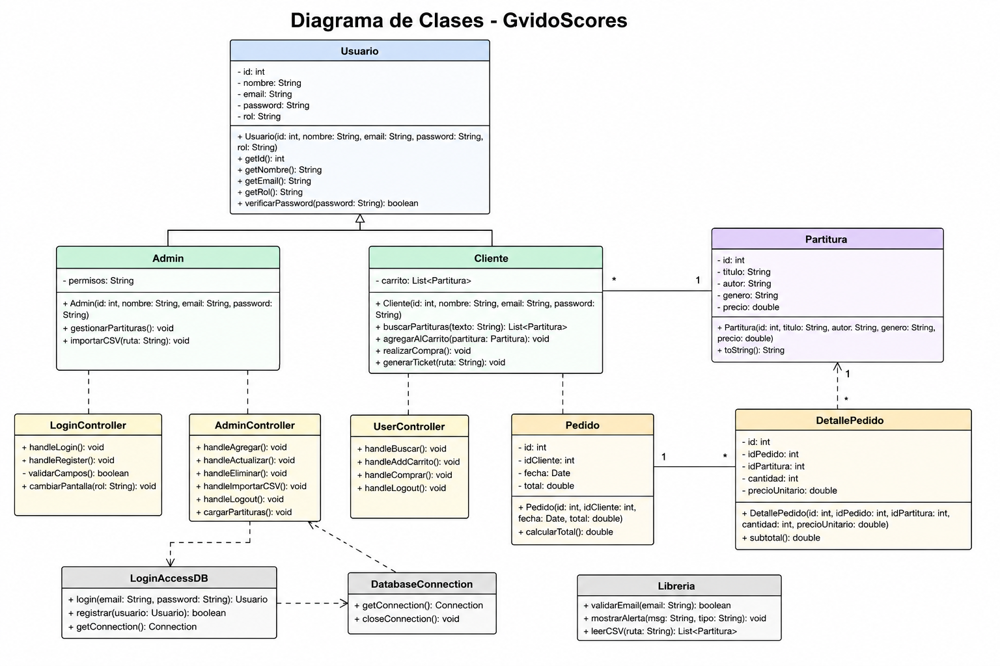
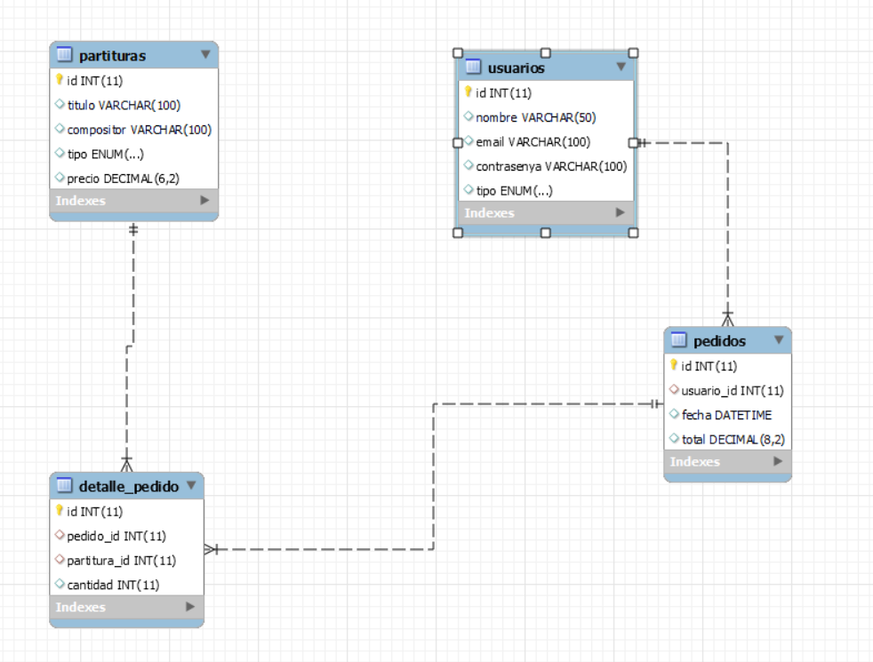

# GvidoScores

## Descripción del proyecto

GvidoScores es una aplicación desarrollada en Java utilizando JavaFX y MySQL para la gestión y compra de partituras musicales.

La aplicación diferencia entre usuarios administradores y clientes.

Los administradores pueden:
- Añadir partituras
- Modificar partituras
- Eliminar partituras
- Importar partituras mediante CSV

Los clientes pueden:
- Registrarse
- Iniciar sesión
- Buscar partituras
- Añadir partituras al carrito
- Generar un ticket de compra en formato TXT

---

# Tecnologías utilizadas

- Java
- JavaFX
- FXML
- CSS
- JDBC
- MySQL
- GitHub
- Markdown

---

# Estructura del proyecto

## app
Contiene las clases principales del proyecto y los modelos de usuario.

### Clases:
- Usuario
- Admin
- Cliente
- Gestor

---

## view
Contiene las vistas gráficas, controladores y archivos CSS.

### Archivos:
- LoginView.fxml
- AdminView.fxml
- UserView.fxml
- LoginController.java
- AdminController.java
- UserController.java
- estilos.css
- estilos2.css
- estilos3.css

---

## mysql
Contiene las clases de acceso a base de datos.

### Clases:
- LoginAccessDB

---

## util
Contiene clases auxiliares.

### Clases:
- DatabaseConnection
- Libreria

---

# Funcionamiento de la aplicación

## Pantalla Login

El usuario puede:
- iniciar sesión
- registrarse

El sistema valida:
- formato del email mediante regex
- existencia previa del email



---

## Panel Administrador

El administrador puede:
- añadir partituras
- actualizar partituras
- eliminar partituras
- importar partituras desde CSV



---

## Importación CSV

El sistema permite importar partituras automáticamente desde un archivo CSV.

Ejemplo:

```csv
Claro de Luna,Beethoven,clasica,14.99
```

---

## Panel Cliente

El cliente puede:
- buscar partituras
- añadirlas al carrito
- generar una compra



---

## Generación de ticket TXT

Al finalizar la compra se genera automáticamente un archivo `.txt` con:
- partituras compradas
- precios
- total



---

# Base de datos

La aplicación genera automáticamente la base de datos al iniciarse por primera vez.

Tablas utilizadas:
- usuarios
- partituras
- pedidos
- detalle_pedido

---

# Diagrama de clases



---

# Diagrama entidad relación



---

# Características principales

- Arquitectura separada mediante MVC
- Uso de JavaFX y FXML
- Uso de CSS para estilos
- Persistencia mediante MySQL
- Validación de formularios
- Generación automática de TXT
- Importación CSV
- Diferenciación de roles

---

# Autor

Sebastián Zuluaga
